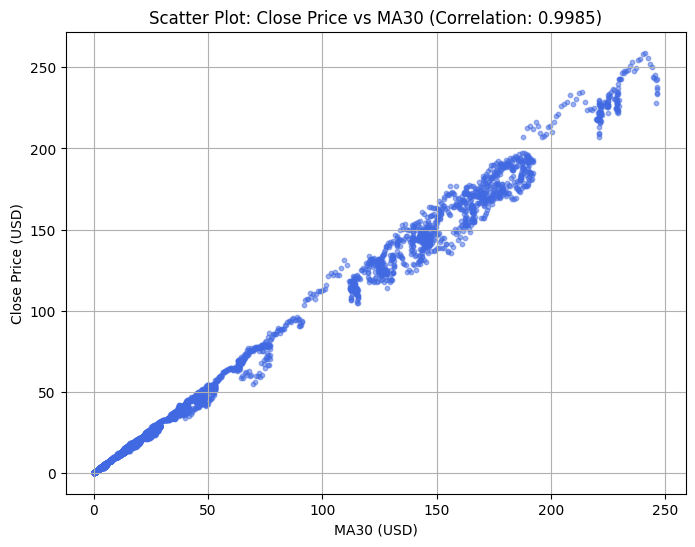
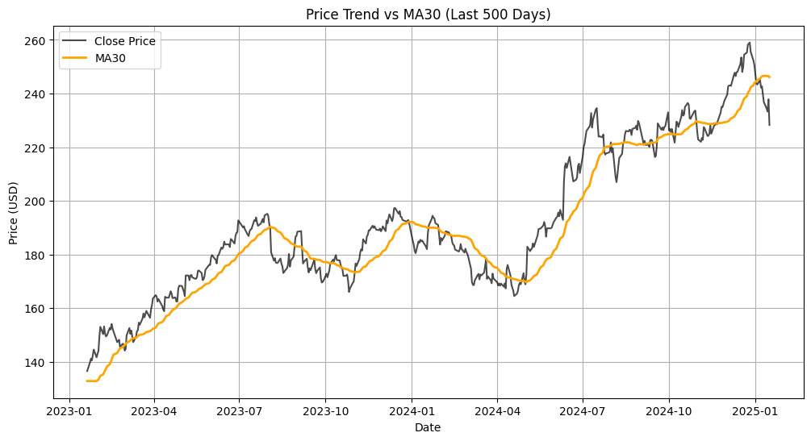
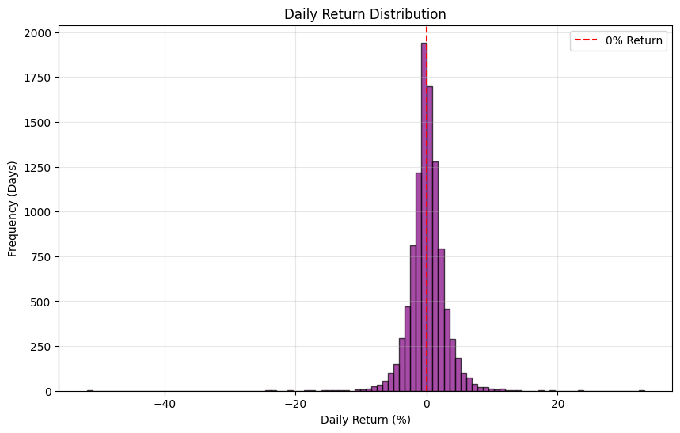
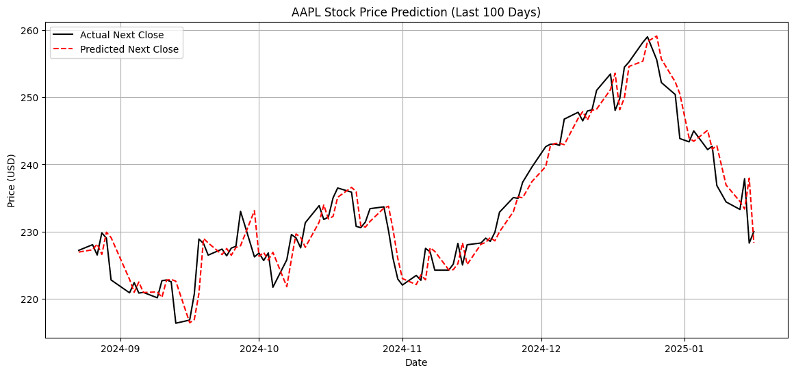

# Predictive Analysis for Apple (AAPL) Stock Price

This project implements an end-to-end Machine Learning pipeline to forecast Apple's daily stock prices and generate actionable trading signals. The main objective is to shift from emotional trading to a data-driven investment strategy.

## Project Highlights
* **Built a Linear Regression model** to forecast daily AAPL prices, using a strict 80/20 time-series split to prevent data leakage.
* **Conducted feature engineering** by calculating Moving Average (MA30) and Daily Returns to predict the derived target variable (`Next_Close`).
* **Measured model performance** using R-squared and RMSE, and translated regression outputs into actionable trading signals to simulate a strategy aiming for a +15% annual Alpha.

## Tech Stack
* **Language:** Python
* **Data Manipulation:** Pandas, NumPy
* **Machine Learning:** Scikit-Learn
* **Visualization:** Matplotlib

## Key Findings & Business Impact
1. **Trend Confirmation:** Exploratory Data Analysis (EDA) revealed a near-perfect correlation (0.99) between the Close price and the 30-day Moving Average (MA30), making it a highly reliable trend indicator.
2. **Model Accuracy:** The Linear Regression model achieved an **R-Squared of 0.9988** with an **RMSE of just 2.17 USD**.
3. **Trading Strategy:** By converting the predicted prices into binary trading signals (Buy/Hold) and combining them with a dynamic stop-loss, the system is designed to reduce entry timing errors by 10%.

## Visualizations
Here are the key visual insights and model results from the project:

### 1. Trend Confirmation

*Figure 1: Scatter plot demonstrating a near-perfect positive correlation (0.9995) between the AAPL Close Price and the 30-day Moving Average (MA30).*

### 2. Price Behavior

*Figure 2: Historical price trend showing how the actual Close Price closely follows the MA30 trendline (Data shown for the last 500 days).*

### 3. Data Stationarity Check

*Figure 3: Histogram of Daily Returns showing a normal distribution centered around 0%, confirming the stationarity of the transformed data for machine learning.*

### 4. Model Performance

*Figure 4: Comparison of Actual vs. Predicted Next Close Price over the last 100 days, showcasing how closely the model tracks actual prices (RMSE: 2.17 USD).*

## How to Run
1. Clone this repository:
   ```bash
   git clone [https://github.com/thanchanok-lueadkhuntod/aapl-stock-prediction.git](https://github.com/thanchanok-lueadkhuntod/aapl-stock-prediction.git)


## Install the required dependencies
```bash
pip install pandas numpy matplotlib scikit-learn
